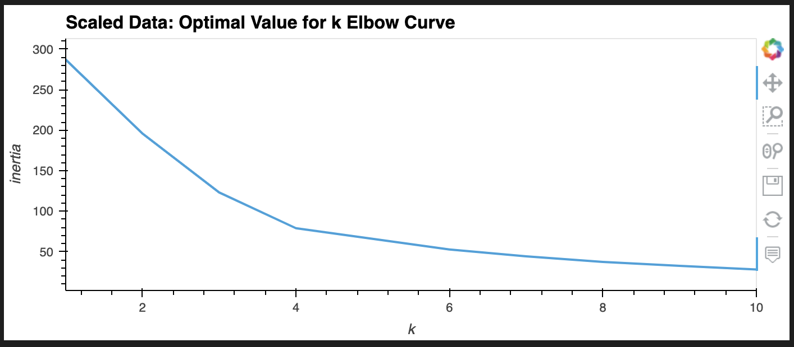
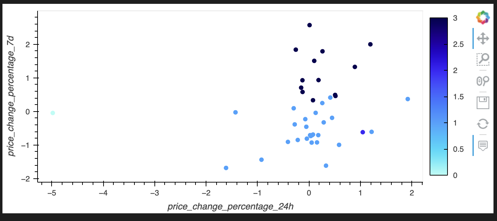
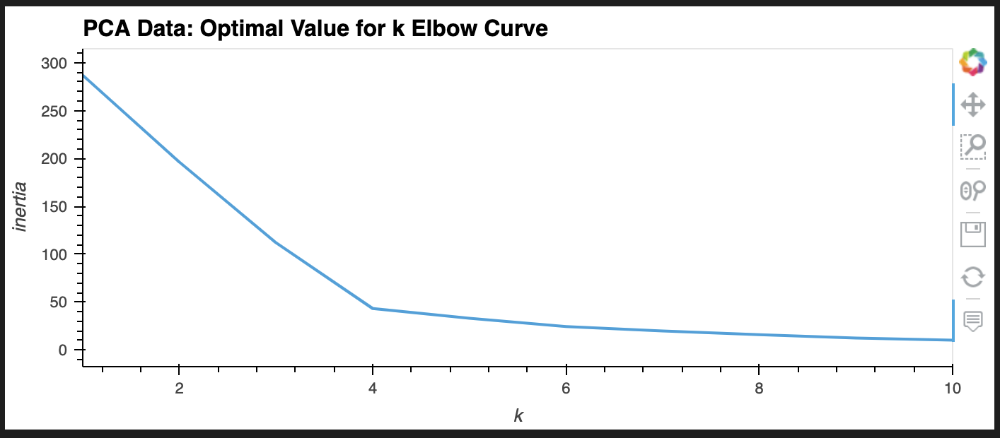
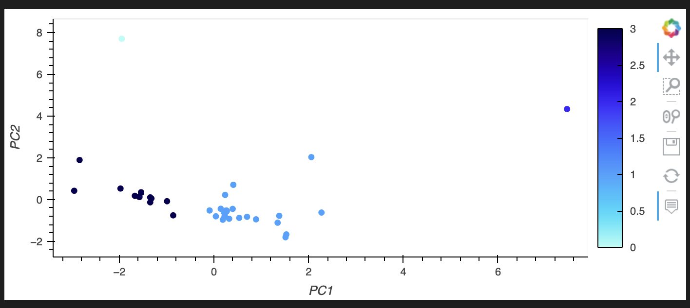

# CryptoClustering
# Module 19
* Ana Gonzalez

## Files

Here you will find the completed files for this challenge.
* CryptoClustering.ipynb - My Jupyter notebook with the completed code to process this assignment.
* Resources Folder with the provided-
  * crypto_market_data.csv
  * PCA_Cluster_Plot.png
  * PCA_Elbow_Curve.png
  * Scaled_Cluster_Plot.png
  * Scaled_Elbow_Curve.pn

## Results

Answer the following question: 

* **Question:** What is the best value for `k`?

* **Answer:** Based on the data gathered, the best value for k would be 4.

  

Using the scaled data also showed cluster overlapping one another, which could lead to a misinterpretation and named a poor fit.

  

Answer the following questions: 

* **Question:** What is the best value for `k` when using the PCA data?

* **Answer:** Based on the PCA data, the optimal value for 'k' is still 4.

* **Question:** Does it differ from the best k value found using the original data?

* **Answer:** The value of 'k' does not differ from the original data.

  

With the PCA data, the clusters being plotted are easier to differentiate and has a more precise outcome.

  

